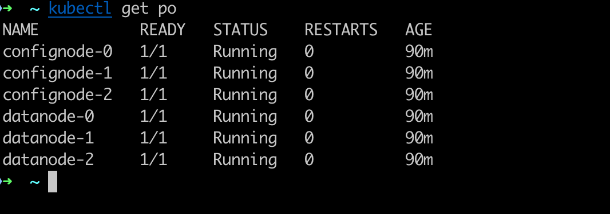
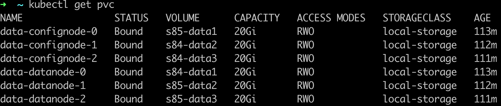
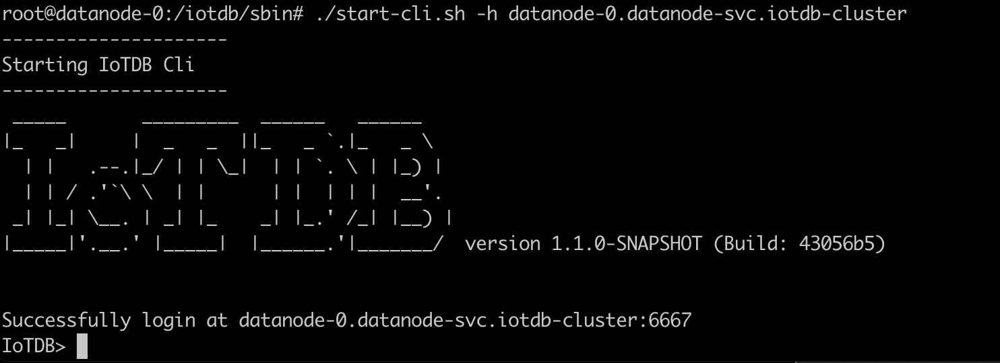
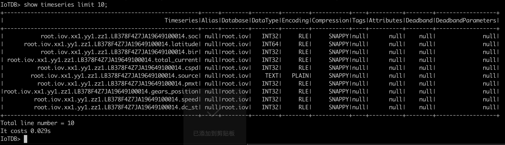
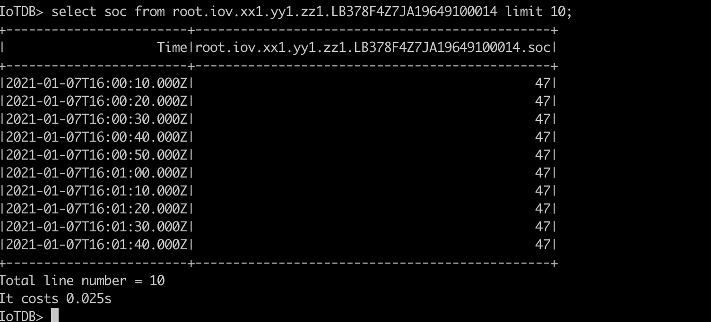

<!--

    Licensed to the Apache Software Foundation (ASF) under one
    or more contributor license agreements.  See the NOTICE file
    distributed with this work for additional information
    regarding copyright ownership.  The ASF licenses this file
    to you under the Apache License, Version 2.0 (the
    "License"); you may not use this file except in compliance
    with the License.  You may obtain a copy of the License at

        http://www.apache.org/licenses/LICENSE-2.0

    Unless required by applicable law or agreed to in writing,
    software distributed under the License is distributed on an
    "AS IS" BASIS, WITHOUT WARRANTIES OR CONDITIONS OF ANY
    KIND, either express or implied.  See the License for the
    specific language governing permissions and limitations
    under the License.

-->

# IoTDB CLuster on Kubernetes

## Deployment

### Deployment environment preparation

Make sure that the current environment has the following tools installed and can successfully connect to the corresponding Kubernetes cluster.

* kubectl
* helm (version >= v3.0.0)

### Parameter Configuration

Modify the configuration parameters in the `helm/values.yaml` file according to the corresponding requirements. Specifically:

1. Verify the current cluster's storage medium and specify the corresponding `storageClass`. IoTDB will create a `pv` on the corresponding data storage medium based on the `storageClass`.

    ```
    storage:
        className: local-storage # Set this value to the storage medium available in the current Kubernetes environment
    ```

2. Confirm the scale of the cluster
    ```
    datanode:
        # The number of DataNodes nodeCount: 3
        nodeCount: 3 
        # The size of each datanode's corresponding data directory needs to be specified based on the designed data volume, and it cannot be modified afterward. In production environments, it is recommended to provide sufficient space based on the size of the data.
        storageCapacity: 20Gi 

    confignode:
        # The number of ConfigNodes nodeCount: 3
        nodeCount: 3
        #The size of the PVC used by confignode is generally not more than 10Gi, and the default value can be used directly.
        storageCapacity: 10Gi 
    ```

3. Verify the number of replicas

   The IoTDB cluster can provide the ability to store multiple copies of data. You can choose a flexible storage medium based on your own usage. For example, if the storage medium corresponding to the storageClass does not provide data replication capabilities, you can set the metadata replication to 3 and the data replication to 3 to ensure data availability. If the storage medium corresponding to the storageClass has data redundancy, no data replication is needed at the IoTDB cluster level, and the metadata replication can be set to 1, and the data replication can be set to 1 or 2.

    ```
    confignode:
        # Number of metadata replicas 
        schemaReplicationFactor: 1
        # Number of data replicas
        dataReplicationFactor: 2
    ```


### Start the deployment

Go to the  `./helm/` directory and exec `install` command to install the IoTDB Cluster in a Kubernetes environment.

```
helm install iotdb-cluster .
```

### Wait for the deployment to complete

You can use the `kubectl` command to view the progress of the deployment. When all the pods are in the Running state, the system is considered to be in a healthy state, as shown in the following figure: 

## Connect to the cluster

### To connect to a cluster in a Kubernetes environment

The address of a DataNode is `datanode-<N>.datanode-svc.iotdb-cluster`,with port number `6667`,You need to modify the value of `<N>` in the address according to the index of the DataNode you want to connect to. For example, `datanode-0.datanode-svc.iotdb-cluster` represents the address of DataNode-0.

### Connect to the cluster from outside the cluster

If you want to connect to the cluster from outside via a program, you need to map the datanode-svc in the cluster to an address that can be accessed from outside the cluster; this may depend on the cloud characteristics of the current Kubernetes cluster.
For example, if your Kubernetes cluster has the "LoadBalancer" feature, you can map the 6667 port of the datanode to the outside of the cluster.

If you only need to perform local testing, you can map the 6667 port of the node datanode to a certain port on a Kubernetes cluster node through the `nodePort` method, and connect to the datanode by the mapped port and the IP address of the node. You can refer to
```
# node-port.yaml
apiVersion: v1
kind: Service
metadata:
  namespace: iotdb-cluster
  name: datanode-nodeport
spec:
  type: NodePort
  ports:
  - port: 6667
    targetPort: 6667
    nodePort: 32667
  selector:
    app: datanode
```

## Demonstration Effects

### Cluster Deployment and Operational Status

We will show the operation status of each component in the cluster after deploying with 3 ConfigNodes and 3 DataNodes as an example.

1. Status of Pods

    

2. Use of PVC

    

   Each confignode and datanode will use a separate PVC and persist its data to the corresponding PVC.

### Connect and access the cluster within the cluster

1. Use the CLI to establish a connection to the cluster's internal address of the datanode.

    


2. Show the node status in the cluster.

    

   It can be seen that the node addresses in the cluster are all internal FQDNs in Kubernetes.

3. Show the top 10 time series in the cluster (after test data has been written)

    

3. Perform data queries

    